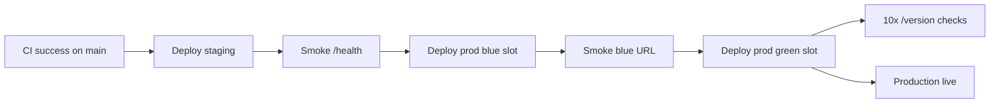

# Job Hunt CRM

Application tracker with resume-to-JD match scoring, analytics, and a web dashboard.

**Course documentation:** [docs/README.md](docs/README.md) (user stories, manual tests, CD process, charter).

## Stack

- **FastAPI** + Jinja2 UI + REST API (`/api/v1`)
- **SQLAlchemy** + Alembic + PostgreSQL (Railway) / SQLite (local)
- **pytest** + GitHub Actions CI/CD
- **Railway** deployment

## Local setup

```bash
python -m venv .venv
.venv\Scripts\pip install -r requirements.txt   # Windows
cp .env.example .env                            # optional
alembic upgrade head
uvicorn app.main:app --reload
```

- UI: http://127.0.0.1:8000/
- API docs: http://127.0.0.1:8000/docs
- Health: http://127.0.0.1:8000/health

### Demo seed (optional)

```bash
python -m app.seed
# demo@jobcrm.dev / demo12345
```

## Tests & lint

```bash
ruff check app tests alembic
pytest --cov=app --cov-fail-under=75
```

## Railway setup (one-time)

1. Create a [Railway](https://railway.app) project and connect this GitHub repo.
2. Add **PostgreSQL** plugin → Railway sets `DATABASE_URL` on the web service.
3. Create **3 web services** in the same project (free tier workaround for blue/green):
   - `jobcrm-staging`
   - `jobcrm-prod-blue` (inactive slot)
   - `jobcrm-prod-green` (active public URL)
4. Set environment variables on each web service:

| Variable | Example |
|----------|---------|
| `DATABASE_URL` | from Postgres plugin (reference) |
| `SECRET_KEY` | long random string |
| `ENV` | `production` |
| `DEBUG` | `false` |
| `SEED_DEMO_DATA` | `true` on staging only (first deploy) |

5. Railway uses [`railway.toml`](railway.toml) → runs migrations + uvicorn via [`scripts/start.sh`](scripts/start.sh).

6. Create a **Project Token** in Railway → GitHub secret `RAILWAY_TOKEN`.

## GitHub Actions secrets

| Secret | Description |
|--------|-------------|
| `RAILWAY_TOKEN` | Railway project token |
| `RAILWAY_PROJECT_ID` | Project ID |
| `RAILWAY_SERVICE_ID_STAGING` | Staging service ID |
| `RAILWAY_SERVICE_ID_PROD_BLUE` | Blue (inactive) service ID |
| `RAILWAY_SERVICE_ID_PROD_GREEN` | Green (active) service ID |
| `STAGING_URL` | `https://jobcrm-staging-....up.railway.app` |
| `PRODUCTION_BLUE_URL` | Blue service public URL |
| `PRODUCTION_URL` | Green / primary production URL |

## CI/CD pipelines

See also [docs/process/cd-process.md](docs/process/cd-process.md) for rollback and blue-green details.

### CI ([`.github/workflows/ci.yml`](.github/workflows/ci.yml))

- **lint** — Ruff
- **test** — pytest, coverage ≥ 75%, artifact upload
- **semver** — on tag `v*.*.*`, validates tag matches [`app/version.py`](app/version.py)

### CD ([`.github/workflows/cd.yml`](.github/workflows/cd.yml))

Triggered after **successful CI on `main`**, or manually via **workflow_dispatch**.



**Blue-green strategy:** deploy + smoke on **blue** slot first, then deploy **green** (public traffic target). Manifests saved as workflow artifacts (`staging.json`, `production-active.json`).

**Rollback:** Actions → CD → **Run workflow** → `rollback-production` + git SHA → redeploys green slot + smoke test.

**Monitoring:** post-deploy jobs call [`scripts/smoke_test.sh`](scripts/smoke_test.sh) (`/health`, `/version`, `/docs`).

## Release versioning (SemVer)

1. Bump [`app/version.py`](app/version.py) → e.g. `1.0.0`
2. Commit, tag, push:

```bash
git tag v1.0.0
git push origin main --tags
```

CI **semver** job validates `v1.0.0` ↔ `__version__`.

## Project layout

```
app/
  algorithms/     # match, keywords, priority, ...
  api/v1/         # REST endpoints
  web/            # Jinja2 dashboard
  services/       # CRUD + scoring + analytics
  seed.py         # demo data
scripts/
  start.sh        # Railway entrypoint
  smoke_test.sh   # post-deploy checks
```
