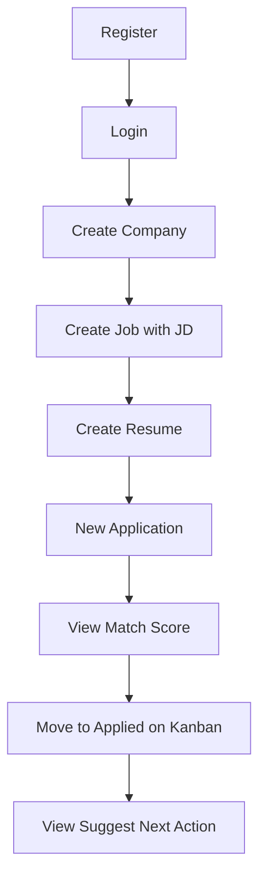

# Wireframes (інвентар екранів)

Wireframes реалізовані як Jinja2 + Bootstrap 5. Figma опційно — карта екранів нижче відповідає live UI.

## Карта екранів

| # | Route | Екран | Ключові елементи |
|---|-------|-------|------------------|
| 1 | `/login` | Вхід | email, password, посилання на register |
| 2 | `/register` | Реєстрація | name, email, password |
| 3 | `/` | Dashboard | 4 KPI-картки, список avg days по стадіях |
| 4 | `/companies` | Список компаній | таблиця, Add company |
| 5 | `/companies/new` | Форма компанії | name, industry, size, website |
| 6 | `/companies/{id}/edit` | Редагування | ті самі поля + delete |
| 7 | `/jobs` | Список вакансій | title, company, salary, status |
| 8 | `/jobs/new` | Форма вакансії | company select, JD textarea, salary |
| 9 | `/jobs/{id}` | Деталі вакансії | description, keyword badges, track link |
| 10 | `/applications` | Kanban | 8 колонок по stage, картки з scores |
| 11 | `/applications/new` | Нова заявка | job + resume select, stage |
| 12 | `/applications/{id}` | Деталі заявки | scores, next action, history, notes |
| 13 | `/resumes` | Список резюме | картки, active badge, activate |
| 14 | `/resumes/new` | Форма резюме | title, content textarea |
| 15 | `/docs` | API Swagger | OpenAPI (окремий layout) |

## User flow: перша заявка

## Нотатки дизайну

- **Навігація:** темний navbar на всіх автентифікованих сторінках
- **Kanban:** горизонтальний scroll на mobile; dropdown stage на картці
- **Scores:** badges match % і priority на kanban-картках
- **Keywords:** badge list на job detail (TF-IDF extract)

