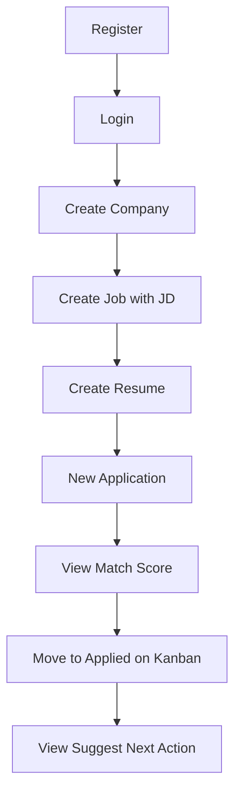

# UI wireframes (screen inventory)

Wireframes implemented as Jinja2 + Bootstrap 5 pages. Figma optional — screen map below matches live UI.

## Screen map

| # | Route | Screen | Key elements |
|---|-------|--------|--------------|
| 1 | `/login` | Login | email, password, link to register |
| 2 | `/register` | Register | name, email, password |
| 3 | `/` | Dashboard | 4 KPI cards, pipeline avg days list |
| 4 | `/companies` | Company list | table, Add company |
| 5 | `/companies/new` | Company form | name, industry, size, website |
| 6 | `/companies/{id}/edit` | Edit company | same fields + delete |
| 7 | `/jobs` | Job list | title, company, salary, status |
| 8 | `/jobs/new` | Job form | company select, JD textarea, salary |
| 9 | `/jobs/{id}` | Job detail | description, keyword badges, track link |
| 10 | `/applications` | Kanban board | 8 columns by stage, cards with scores |
| 11 | `/applications/new` | New application | job + resume select, stage |
| 12 | `/applications/{id}` | Application detail | scores, next action, history, notes |
| 13 | `/resumes` | Resume list | cards, active badge, activate |
| 14 | `/resumes/new` | Resume form | title, content textarea |
| 15 | `/docs` | API Swagger | OpenAPI (external layout) |

## User flow: first application

## Design notes

- **Navigation:** dark navbar on all authenticated pages
- **Kanban:** horizontal scroll on mobile; stage dropdown on each card
- **Scores:** badges for match % and priority on kanban cards
- **Keywords:** badge list on job detail (from TF-IDF extract)

Screenshots: capture from local `uvicorn` after `python -m app.seed` and add to this folder if required by course submission.
