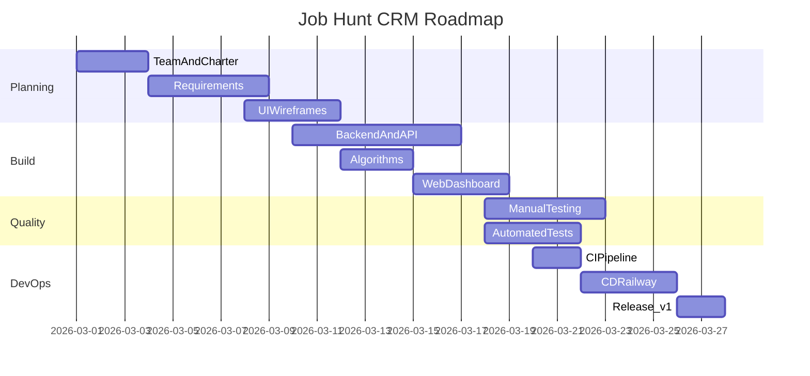

# Roadmap and milestones

## Timeline (Gantt overview)

| Phase | Dates | Deliverable | Points |
|-------|-------|-------------|--------|
| 1. Team & charter | Week 1 | roles.md, charter.md | — |
| 2. Requirements | Week 1–2 | 50+ user stories, traceability | — |
| 3. Design | Week 2 | Wireframes, UI flows | — |
| 4. Implementation | Week 2–3 | FastAPI app, algorithms, UI | — |
| 5. Testing | Week 3 | 100+ manual cases, 56 auto tests | — |
| 6. CI | Week 3 | ci.yml, coverage reports | 25 |
| 7. CD | Week 4 | Railway, cd.yml, rollback | 15 |
| 8. Release | Week 4 | Tag v1.0.0, demo deploy | 20 |

## Risks

| Risk | Impact | Mitigation |
|------|--------|------------|
| Railway free tier sleep | Demo unavailable | `/health` wake on deploy smoke |
| Scope creep | Miss deadline | MVP scope in charter out-of-scope list |
| Low test coverage | Grade penalty | CI `--cov-fail-under=75` |

## Milestone definitions

- **M1 Requirements complete:** user-stories.md ≥ 50, traceability matrix draft
- **M2 MVP code complete:** all CRUD + 8 algorithms + UI pages
- **M3 Quality gate:** 56 automated tests green, 100 manual cases written
- **M4 Production ready:** CI + CD green, staging URL accessible
