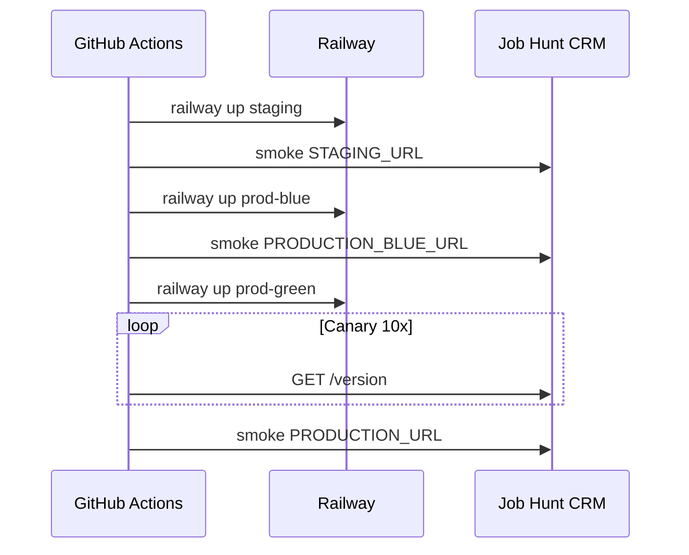

# Continuous Delivery process

Full deployment documentation for Job Hunt CRM. Summary also in [README.md](../../README.md).

## Environments

| Environment | Railway service | URL secret | Purpose |
|-------------|-----------------|------------|---------|
| Staging | `RAILWAY_SERVICE_ID_STAGING` | `STAGING_URL` | Pre-prod validation |
| Production blue | `RAILWAY_SERVICE_ID_PROD_BLUE` | `PRODUCTION_BLUE_URL` | Inactive slot (blue-green) |
| Production green | `RAILWAY_SERVICE_ID_PROD_GREEN` | `PRODUCTION_URL` | Active traffic target |

## Pipeline trigger

1. Developer pushes to `main`
2. **CI** workflow runs (lint + pytest + coverage)
3. On CI success, **CD** workflow runs via `workflow_run`
4. Manual full deploy: Actions → CD → Run workflow → `deploy-all`

## CD stages

## Blue-green strategy

1. **Blue slot** receives new build first; smoke tests validate `/health`, `/version`, `/docs`.
2. **Green slot** (public URL) receives the same build after blue passes — simulates traffic switch.
3. Deploy manifests uploaded as artifacts (`staging.json`, `production-active.json`) with `git_sha`, `active_slot`, timestamp.

## Rollback procedure

1. Identify last good commit SHA from Git history or manifest artifact.
2. GitHub → Actions → **CD** → Run workflow.
3. Select action: `rollback-production`.
4. Enter `rollback_sha` (full or short SHA).
5. Workflow checks out that SHA and runs `railway up` on **green** service.
6. Post-rollback smoke test on `PRODUCTION_URL`.

## Monitoring (post-deploy)

[`scripts/smoke_test.sh`](../../scripts/smoke_test.sh):

- 5× `GET /health` — expects `"status":"ok"` and `"db":"ok"`
- 1× `GET /version`
- 1× `GET /docs` — Swagger HTML

Railway healthcheck: `/health` (see [`railway.toml`](../../railway.toml)).

## Database migrations

Every deploy runs `alembic upgrade head` via [`scripts/start.sh`](../../scripts/start.sh) before uvicorn starts.

## Secrets checklist

- [ ] `RAILWAY_TOKEN`
- [ ] `RAILWAY_PROJECT_ID`
- [ ] `RAILWAY_SERVICE_ID_STAGING`
- [ ] `RAILWAY_SERVICE_ID_PROD_BLUE`
- [ ] `RAILWAY_SERVICE_ID_PROD_GREEN`
- [ ] `STAGING_URL`
- [ ] `PRODUCTION_BLUE_URL`
- [ ] `PRODUCTION_URL`

## SemVer releases

1. Update [`app/version.py`](../../app/version.py)
2. `git tag vX.Y.Z && git push origin vX.Y.Z`
3. CI **semver** job validates tag ↔ version
