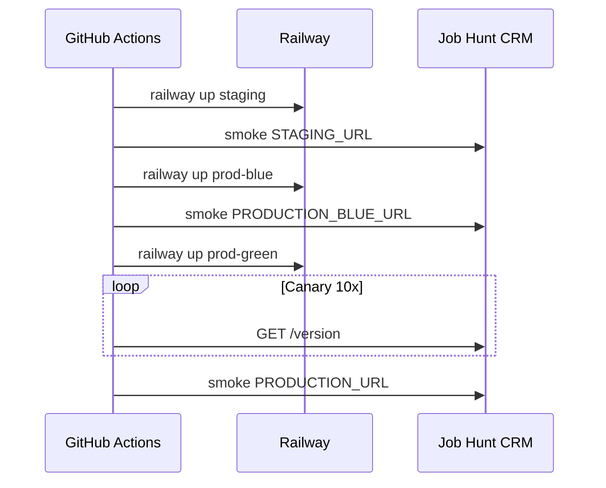

# Процес Continuous Delivery

Документація deploy для Job Hunt CRM. Короткий опис — у [README.md](../../README.md).

## Середовища

| Середовище | Railway service | Secret URL | Призначення |
|------------|-----------------|------------|-------------|
| Staging | `RAILWAY_SERVICE_ID_STAGING` | `STAGING_URL` | Перевірка перед prod |
| Production blue | `RAILWAY_SERVICE_ID_PROD_BLUE` | `PRODUCTION_BLUE_URL` | Неактивний слот (blue-green) |
| Production green | `RAILWAY_SERVICE_ID_PROD_GREEN` | `PRODUCTION_URL` | Активний публічний URL |

## Тригер pipeline

1. Push у `main` або PR → **CI** автоматично (lint + pytest + coverage)
2. **CD лише вручну:** Actions → **CD** → Run workflow → `deploy-all` (branch `main`, після зеленого CI)
3. Rollback: Actions → **CD** → `rollback-production` + git SHA

## Етапи CD

## Стратегія blue-green

1. **Blue slot** отримує новий build першим; smoke перевіряє `/health`, `/version`, `/docs`.
2. **Green slot** (публічний URL) — той самий build після успішного blue (імітація перемикання трафіку).
3. Deploy manifests зберігаються як artifacts (`staging.json`, `production-active.json`) з `git_sha`, `active_slot`, timestamp.

## Rollback

1. Знайти останній good commit SHA в Git або manifest artifact.
2. GitHub → Actions → **CD** → Run workflow.
3. Action: `rollback-production`.
4. Вказати `rollback_sha` (повний або короткий SHA).
5. Workflow checkout SHA і `railway up` на **green** service.
6. Post-rollback smoke на `PRODUCTION_URL`.

## Моніторинг (post-deploy)

[`scripts/smoke_test.sh`](../../scripts/smoke_test.sh):

- 5× `GET /health` — очікується `"status":"ok"` і `"db":"ok"`
- 1× `GET /version`
- 1× `GET /docs` — Swagger HTML

Railway healthcheck: `/health` (див. [`railway.toml`](../../railway.toml)).

## Міграції БД

Кожен deploy виконує `alembic upgrade head` через [`scripts/start.sh`](../../scripts/start.sh) перед uvicorn.

## Чеклист secrets (GitHub Actions)

- [ ] `RAILWAY_TOKEN`
- [ ] `RAILWAY_PROJECT_ID`
- [ ] `RAILWAY_SERVICE_ID_STAGING`
- [ ] `RAILWAY_SERVICE_ID_PROD_BLUE`
- [ ] `RAILWAY_SERVICE_ID_PROD_GREEN`
- [ ] `STAGING_URL`
- [ ] `PRODUCTION_BLUE_URL`
- [ ] `PRODUCTION_URL`

## SemVer releases

1. Оновити [`app/version.py`](../../app/version.py)
2. `git tag vX.Y.Z && git push origin vX.Y.Z`
3. CI job **semver** перевіряє tag ↔ version
