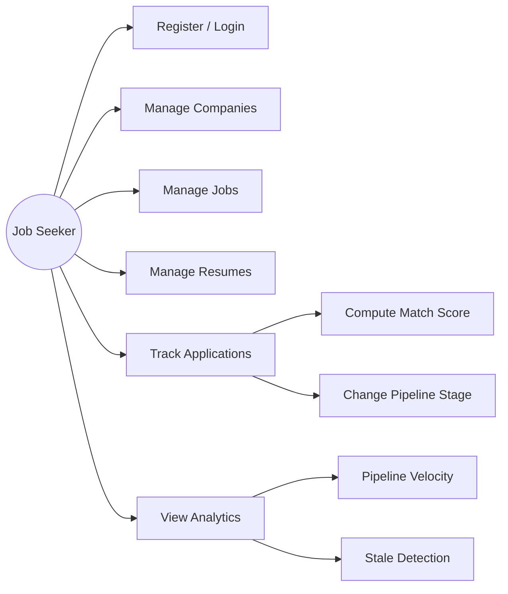

# Requirements traceability matrix

Links user stories → API/UI → automated tests.

| Story ID | Endpoint / UI | Automated test(s) |
|----------|---------------|-------------------|
| US-AUTH-01 | POST `/api/v1/auth/register` | `test_register_and_login` |
| US-AUTH-02 | POST `/api/v1/auth/login` | `test_register_and_login`, `test_me_after_login` |
| US-AUTH-03 | POST `/api/v1/auth/logout` | `test_logout` |
| US-AUTH-04 | GET `/api/v1/auth/me` | `test_me_after_login` |
| US-AUTH-05 | Protected API | `test_me_requires_auth` |
| US-AUTH-06 | GET `/` | `test_dashboard_redirects_to_login` |
| US-COMP-01..05 | Company CRUD | `test_company_crud` |
| US-CONT-01..02 | Contact CRUD | `test_contact_and_note` |
| US-JOB-01..05 | Job CRUD + flow | `test_job_and_application_flow` |
| US-RES-01..05 | Resume CRUD + activate | `test_resume_activate` |
| US-APP-01..06 | Application flow | `test_job_and_application_flow` |
| US-APP-07..09 | Auto scores | `test_application_scores_are_computed_on_create` |
| US-APP-12 | suggest-action | `test_suggest_action_endpoint` |
| US-NOTE-01 | Note on company | `test_contact_and_note` |
| US-ALG-01 | match | `test_match_endpoint`, `test_match_*` (unit) |
| US-ALG-02 | extract-keywords | `test_extract_keywords_endpoint`, `test_keywords_*` |
| US-ALG-03 | pipeline | `test_pipeline_and_stale_analytics`, `test_pipeline_*` |
| US-ALG-04 | stale | `test_pipeline_and_stale_analytics`, `test_stale_*` |
| US-ALG-05 | salary-benchmark | `test_salary_benchmark_endpoint`, `test_salary_*` |
| US-ALG-06 | Dashboard | `test_dashboard_after_auth` |
| US-SYS-01 | `/health` | `test_health_endpoint` |
| US-SYS-06 | seed | `test_seed_creates_demo_data`, `test_seed_is_idempotent` |

## Use case diagram (high level)

## Algorithm traceability

| ALG ID | Function | Unit tests |
|--------|----------|------------|
| ALG-001 | `match_resume_to_jd` | `tests/unit/algorithms/test_match.py` (4) |
| ALG-002 | `extract_keywords` | `test_keywords.py` (4) |
| ALG-003 | `score_application_priority` | `test_priority.py` (4) |
| ALG-004 | `predict_response_likelihood` | `test_likelihood.py` (4) |
| ALG-005 | `salary_benchmark` | `test_salary.py` (4) |
| ALG-006 | `detect_stale_applications` | `test_stale.py` (4) |
| ALG-007 | `suggest_next_action` | `test_actions.py` (4) |
| ALG-008 | `pipeline_velocity` | `test_pipeline.py` (4) |

**Total automated tests: 56**
